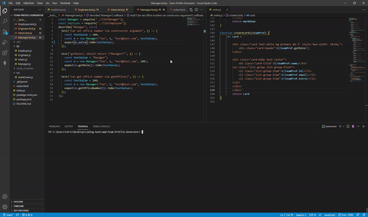

# Team Profile Generator 

  ## Description 
  Allows a team to create cards signifying the role, id, and email of different employees on an HTML file

  ## Table of Contents
  * [Installation](#installation)
  * [Usage](#usage)
  * [License](#license)
  * 
  ## Installation
  In the terminal, run npm i. Then run index.js in the terminal.

  ## Usage 
  Create a profile for your team

  ## License
  This product uses a MIT license

  ## Demo
  
  Video of full demo here -- https://drive.google.com/file/d/1PzRbg6LqjJuyZVgxoMIXV1-jbPhh95bw/view?usp=sharing

  ## Questions
  For additional questions feel free to contact: chrischo2012@gmail.com
  GitHub: https://github.com/chrischo94
  